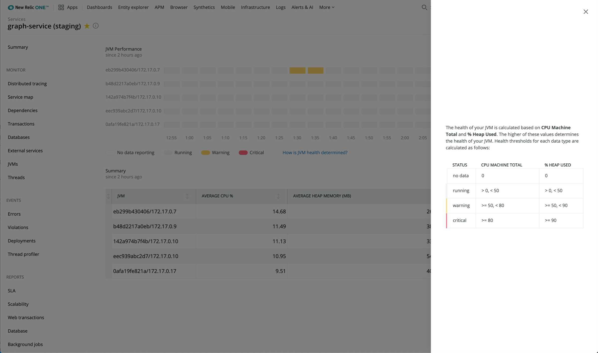
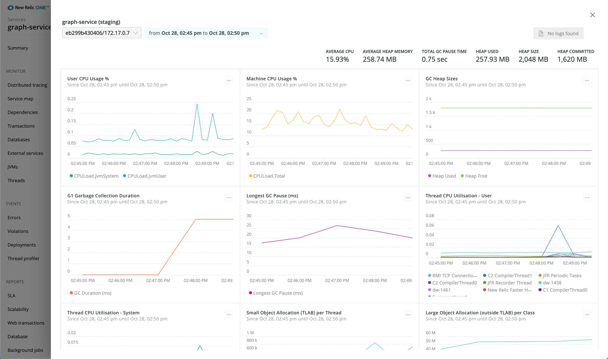
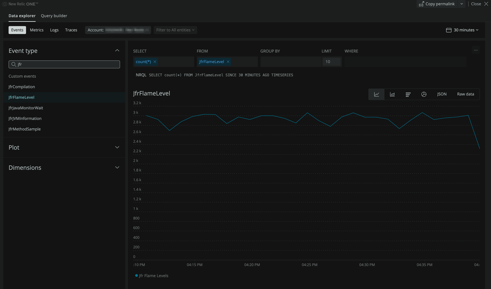
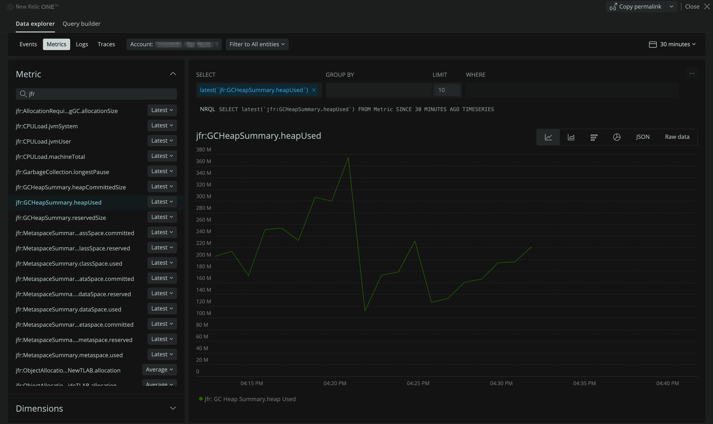

[](https://opensource.newrelic.com/oss-category/#community-plus)

# JFR core


This repository contains the core New Relic JFR components. It is used 
to consume JFR events, transform them into New Relic telemetry, and send them to New Relic 
(with the [New Relic Telemetry SDK](https://github.com/newrelic/newrelic-telemetry-sdk-java)) where they
can be [visualized](#visualizing-jfr-data) in a number of ways.

This repository contains the following modules:
* [jfr-daemon](#jfr-daemon) - A monitoring tool that uses a rotating fileset to consume JFR events and near-continuously send telemetry data to New Relic.
* [jfr-mappers](#jfr-mappers) - Mappers that transform JFR `RecordedEvent` objects into New Relic telemetry data. Also 
contains registries of all supported mappers. This is used as an implementation library by `jfr-daemon`.
* [jfr-jlink](#jfr-jlink) - A module that produces jlink binaries of `jfr-daemon` that include a bundled JRE.
* [jfr-tools](#jfr-tools) - Tools that can be used to analyze `jfr-daemon`.
* [smoke-tests](#smoke-tests) - Smoke tests for the different `jfr-daemon` usage scenarios.

---

## Building

This project uses Java 11 and the gradle wrapper. To build it, run:

```
$ git clone https://github.com/newrelic/newrelic-jfr-core.git
$ cd newrelic-jfr-core
$ ./gradlew build
```

The resulting jars of interest are:
 * `jfr-mappers/build/libs/jfr-mappers-<version>.jar`
 * `jfr-daemon/build/libs/jfr-daemon-<version>.jar`

---

## Running tests

Unit tests are run with gradlew:

```
$ ./gradlew test
```

---

## JFR daemon

There are three different usage scenarios for the `jfr-daemon`: 
* [New Relic Java agent JFR service](#new-relic-java-agent-jfr-service) (RECOMMENDED) - JFR monitoring built into the flagship New Relic Java agent. No additional setup needed, simply [install the Java agent](https://docs.newrelic.com/docs/agents/java-agent/installation/install-java-agent/), make sure that the [JFR service is enabled](https://docs.newrelic.com/docs/agents/java-agent/configuration/java-agent-configuration-config-file/#jfr-real-time-profiling), and JFR data will flow into the same APM application as the Java agent.
* [Standalone process](#standalone-process) - Run the `jfr-daemon` as a standalone process and configure it to monitor an existing Java process using remote JMX.
* [Standalone Java agent](#standalone-java-agent) - Attach the `jfr-daemon` to your Java process as a Java agent. A lightweight alternative to the 
  New Relic Java agent.

For additional details see:
* [Real-time profiling for Java using JFR metrics](https://docs.newrelic.com/docs/agents/java-agent/features/real-time-profiling-java-using-jfr-metrics/)
* [Java agent configuration](https://docs.newrelic.com/docs/agents/java-agent/configuration/java-agent-configuration-config-file/)

### Supported Java versions

While the `jfr-daemon` supports any version of Java 11 and above, we do not recommend using any non-LTS version of Java in production environments.

Some vendors have backported JFR to their Java 8 binaries. For instance, OpenJDK backported JFR on version 8u262. The `jfr-daemon` is compatible with those Java versions.

### New Relic Java agent JFR service

The recommended way to get JFR data is to use the New Relic Java agent with builtin JFR monitoring. 
This will provide the richest experience by combining data collected by the New Relic Java agent with JFR data together in a single New Relic One entity.

#### Requirements for New Relic Java agent JFR service

The New Relic Java agent JFR monitoring has the following requirements:
* [New Relic Java agent version 7.0.0+](https://docs.newrelic.com/docs/release-notes/agent-release-notes/java-release-notes/java-agent-700/)
* [APM license key](https://docs.newrelic.com/docs/apis/get-started/intro-apis/new-relic-api-keys#ingest-license-key)
* JFR must be enabled in the agent config
* Uses a [supported Java version](#supported-java-versions)

Notice: If you were previously using the [jfr-daemon](https://github.com/newrelic/newrelic-jfr-core) as an agent extension or standalone process you should remove that option to avoid potential conflicts with the JFR service that is now built into the agent.

#### Usage for New Relic Java agent JFR service

[Install the New Relic Java agent](https://docs.newrelic.com/docs/agents/java-agent/installation/install-java-agent/#install-agent)
by adding the `-javaagent` parameter to your JVM properties and enable JFR monitoring using one of the following mechanisms:

Agent yaml config (the following should be nested under the `common` stanza):

```yaml
  # Real-time profiling using Java Flight Recorder (JFR).
  # This feature reports dimensional metrics to the ingest endpoint configured by
  # metric_ingest_uri and events to the ingest endpoint configured by event_ingest_uri.
  # Both ingest endpoints default to US production but they will be automatically set to EU
  # production when using an EU license key. Other ingest endpoints can be configured manually.
  # Requires a JVM that provides the JFR library.
  jfr:

    # Set to true to enable Real-time profiling with JFR.
    # Default is true.
    enabled: true

    # Set to true to enable audit logging which will display all JFR metrics and events in each harvest batch.
    # Audit logging is extremely verbose and should only be used for troubleshooting purposes.
    # Default is false.
    audit_logging: false
```

System property:

```
-Dnewrelic.config.jfr.enabled=true
```

Environment variable:

```
export NEW_RELIC_JFR_ENABLED=true
```

By default, the New Relic Java agent will send JFR data to New Relic US production metric and event ingest endpoints.
JFR data will be associated with the APM entity generated by the New Relic Java agent as defined by your `app_name` and `license_key`. 
To change this or other behavior see [configuration for New Relic Java agent JFR service](#configuration-for-new-relic-java-agent-jfr-service).

#### Configuration for New Relic Java agent JFR service

When using the New Relic Java agent, the JFR service fully respects agent configuration settings.

The New Relic Java agent is configurable via a
[yaml configuration file](https://docs.newrelic.com/docs/agents/java-agent/configuration/java-agent-configuration-config-file/),
[system properties](https://docs.newrelic.com/docs/agents/java-agent/configuration/java-agent-configuration-config-file/#System_Properties),
and [environment variables](https://docs.newrelic.com/docs/agents/java-agent/configuration/java-agent-configuration-config-file/#Environment_Variables).

The following agent configuration options affect how and where JFR data is reported:
* [app_name](https://docs.newrelic.com/docs/agents/java-agent/configuration/java-agent-configuration-config-file/#cfg-app_name)
* [license_key](https://docs.newrelic.com/docs/agents/java-agent/configuration/java-agent-configuration-config-file/#cfg-license_key)
* [jfr.enabled](https://docs.newrelic.com/docs/agents/java-agent/configuration/java-agent-configuration-config-file/#jfr-enabled)
* [jfr.audit_logging](https://docs.newrelic.com/docs/agents/java-agent/configuration/java-agent-configuration-config-file/#jfr-audit_logging)
* [metric_ingest_uri](https://docs.newrelic.com/docs/agents/java-agent/configuration/java-agent-configuration-config-file/#metric_ingest_uri)
* [event_ingest_uri](https://docs.newrelic.com/docs/agents/java-agent/configuration/java-agent-configuration-config-file/#event_ingest_uri)
* [proxy_host](https://docs.newrelic.com/docs/agents/java-agent/configuration/java-agent-configuration-config-file/#cfg-proxy_host)
* [proxy_password](https://docs.newrelic.com/docs/agents/java-agent/configuration/java-agent-configuration-config-file/#cfg-proxy_password)
* [proxy_port](https://docs.newrelic.com/docs/agents/java-agent/configuration/java-agent-configuration-config-file/#cfg-proxy_port)
* [proxy_user](https://docs.newrelic.com/docs/agents/java-agent/configuration/java-agent-configuration-config-file/#cfg-proxy_user)
* [proxy_scheme](https://docs.newrelic.com/docs/agents/java-agent/configuration/java-agent-configuration-config-file/#cfg-proxy_scheme)

### Standalone process

The `jfr-daemon` can be used as a stand-alone process that consumes JFR events
from an existing java process and sends telemetry to New Relic. This daemon
process issues commands over JMX to periodically generate a series of rolling
JFR files. It uses these files to build a "pseudo stream" of telemetry events.

#### Requirements for standalone process

The `jfr-daemon` standalone process has the following requirements:
* An [Insights insert API key](https://docs.newrelic.com/docs/apis/get-started/intro-apis/types-new-relic-api-keys#event-insert-key) or
  an [APM license key](https://docs.newrelic.com/docs/apis/get-started/intro-apis/new-relic-api-keys#ingest-license-key).
  To use an APM license key you will need to configure the JFR daemon with `USE_LICENSE_KEY=true`.
* Uses a [supported Java version](#supported-java-versions)

#### Usage for standalone process

The minimum requirements to use the `jfr-daemon` as standalone process are as follows.

Set the app name that the JFR data should be reported to, and an Insights insert key (to use an APM license key also add `export USE_LICENSE_KEY=true`):

```
export NEW_RELIC_APP_NAME=<NAME>
export INSIGHTS_INSERT_KEY=<KEY>
```

Start the `jfr-daemon` standalone process, it will attempt to connect to your application's remote JMX MBean server:

```
java -jar jfr-daemon-<version>.jar
```

By default, the JFR daemon will connect JMX to `localhost` on port `1099` and send data to New Relic US production metric and event ingest endpoints.
To change this or other behavior see [configuration for standalone usage](#configuration-for-standalone-usage).

#### Target application configuration

The target application that you wish to monitor must be configured to expose JFR data over remote JMX by adding the following system properties:

```
-Dcom.sun.management.jmxremote 
-Dcom.sun.management.jmxremote.port=1099 
-Dcom.sun.management.jmxremote.ssl=false 
-Dcom.sun.management.jmxremote.authenticate=false
```

### Standalone Java agent

The `jfr-daemon` can be used as a Java agent that consumes JFR events
by attaching to a java process and sending telemetry to New Relic.
This can be used as a lightweight alternative to the New Relic Java agent JFR service,
if you do not need the additional data captured by the New Relic Java agent, or you require a solution with less overhead.

#### Requirements for standalone Java agent

The `jfr-daemon` standalone Java agent has the following requirements:
* An [Insights insert API key](https://docs.newrelic.com/docs/apis/get-started/intro-apis/types-new-relic-api-keys#event-insert-key) or
  an [APM license key](https://docs.newrelic.com/docs/apis/get-started/intro-apis/new-relic-api-keys#ingest-license-key).
  To use an APM license key you will need to configure the JFR daemon with `USE_LICENSE_KEY=true`.
* Uses a [supported Java version](#supported-java-versions)

#### Usage for standalone Java agent

The minimum requirements to use the `jfr-daemon` as standalone Java agent are as follows.

Set the app name that the JFR data should be reported to, and an Insights insert key (to use an APM license key also add `export USE_LICENSE_KEY=true`): 

```
export NEW_RELIC_APP_NAME=<NAME>
export INSIGHTS_INSERT_KEY=<KEY>
```

Add the `-javaagent` parameter to your JVM properties:

```
-javaagent:/path/to/jfr-daemon-<version>.jar
```

By default, the JFR daemon will send data to New Relic US production metric and event ingest endpoints.
To change this or other behavior see [configuration for standalone usage](#configuration-for-standalone-usage).

### Configuration for standalone usage

The environment variables in this section apply when using the `jfr-daemon` as a [standalone process](#standalone-process)
or [standalone Java agent](#standalone-java-agent), though the JMX settings only apply to the [standalone process](#standalone-process). 

When using the [New Relic Java agent JFR service](#new-relic-java-agent-jfr-service)
the configuration is done through the agent config mechanisms (see [configuration for New Relic Java agent JFR service](#configuration-for-new-relic-java-agent-jfr-service)).

| env var name            | required? | default               | description  |
|-------------------------|-----------|-----------------------|--------------|
| `INSIGHTS_INSERT_KEY`   |     Y     |  n/a                  | The New Relic [insert key](https://docs.newrelic.com/docs/apis/get-started/intro-apis/types-new-relic-api-keys#event-insert-key) or [APM license key](https://docs.newrelic.com/docs/apis/get-started/intro-apis/new-relic-api-keys#ingest-license-key) for your account |
| `USE_LICENSE_KEY`       |     N     |  `false`              | Use a License Key instead of Insights Insert Key. |
| `NEW_RELIC_APP_NAME`    |     N(!)  |  `My Application`     | The name of the remote application being monitored. You should probably set this so that your application shows up properly in the NR1 platform. |
| `REMOTE_JMX_HOST`       |     N     |  `localhost`          | The host to pull JFR data from via JMX |
| `REMOTE_JMX_PORT`       |     N     |  `1099`               | The port to pull JFR data from via JMX |
| `METRICS_INGEST_URI`    |     N     |  [US production](https://metric-api.newrelic.com/metric/v1), [EU production](https://metric-api.eu.newrelic.com/metric/v1) | Where to send metric data |
| `EVENTS_INGEST_URI`     |     N     |  [US production](https://insights-collector.newrelic.com/v1/accounts/events), [EU production](https://insights-collector.eu01.nr-data.net/v1/accounts/events) | Where to send event data |
| `JFR_SHARED_FILESYSTEM` |     N     |  `false`              | Use a shared filesystem instead of streaming data from JMX |
| `AUDIT_LOGGING`         |     N     |  `false`              | [Enables audit logging](https://github.com/newrelic/newrelic-telemetry-sdk-java#enabling-audit-logging) in the underlying Telemetry SDK |
| `PROXY_HOST`            |     N     |  `null`               | Proxy host name |
| `PROXY_PORT`            |     N     |  `null`               | Proxy host port |
| `PROXY_USER`            |     N     |  `null`               | Proxy user name |
| `PROXY_PASSWORD`        |     N     |  `null`               | Proxy password  |
| `PROXY_SCHEME`          |     N     |  `null`               | Proxy scheme (`http` or `https`) |
| `HARVEST_INTERVAL`      |     N     |  `10`                 | How often data from JFR will be sent to New Relic |
| `QUEUE_SIZE`            |     N     |  `250_000`            | How many events are to be sent during each harvest cycle |
| `THREAD_NAME_PATTERN`   |     N     |  <code>((?<=[\W_]&#124;^)([0-9a-fA-F]){4,}(?=[\W_]&#124;$))&#124;\d+</code> | A regex pattern that will be run against thread names, matches will be converted to a `#` to group those threads |

#### Logging

The JFR daemon and the underlying Telemetry SDK logs with the Slf4j-Simple implementation at the default `Info` level.
To increase the logging level, you can configure Slf4j with system properties, or a `simplelogger.properties` file.
For example, set this on the command line to log at the `debug` level:

`-Dorg.slf4j.simpleLogger.defaultLogLevel=debug`

Here is a sample of debug level logs.

```java
[JfrController] DEBUG com.newrelic.telemetry.metrics.MetricBuffer - Creating metric batch.
[JfrController] INFO com.newrelic.jfr.daemon.JFRUploader - Sending metric batch of size 61
[JfrController] DEBUG com.newrelic.telemetry.events.EventBuffer - Creating Event batch.
[Thread-0] DEBUG com.newrelic.telemetry.metrics.MetricBatchSender - Sending a metric batch (number of metrics: 61) to the New Relic metric ingest endpoint)
[Thread-0] DEBUG com.newrelic.telemetry.metrics.json.MetricBatchMarshaller - Generating json for metric batch.
[JfrController] INFO com.newrelic.jfr.daemon.JFRUploader - Sending events batch of size 25
```

---

## JFR jlink

This module produces executable [jlink](https://docs.oracle.com/en/java/javase/11/tools/jlink.html) binaries that bundle the `jfr-daemon` with a JRE that
provides all required libraries. This allows you to run the `jfr-daemon` as a [standalone process](#standalone-process) without needing to explicitly 
provide a separate JRE for the daemon.

The produced binaries can be found in `newrelic-jfr-core/jfr-jlink/build/jlink/jfr-jlink-<version>/bin/`.

This has the same configuration and requirements as the `jfr-daemon` [standalone process](#standalone-process) with the 
lone exception being that the binaries can be directly executed without explicitly starting a JVM (e.g. `./jfr-daemon`).

---

## JFR mappers

This module is a library of reusable JFR (Java Flight Recorder) mappers
used to transform JFR `RecordedEvent` instances into New Relic telemetry collections
that are compatible with the
[telemetry SDK](https://github.com/newrelic/newrelic-telemetry-sdk-java).

We don't intend this library to be used directly. Instead, leverage tools
like the [JFR daemon](#jfr-daemon) that are built upon this library.

### Maven dependency

```
<dependency>
    <groupId>com.newrelic</groupId>
    <artifactId>jfr-mappers</artifactId>
    <version>1.4.0</version>
</dependency>
```

### Gradle dependency

```
compile group: 'com.newrelic', name: 'jfr-mappers', version: '1.4.0'
```

---

## JFR tools

A module providing tools that can be used to analyze `jfr-daemon`. See [jfr-tools/README.md](./jfr-tools/README.md) for details.

---

## Smoke tests

Consists of a `SmokeTestApp` and a suite of tests to verify that the jfr-daemon attaches and sends data for the various usage scenarios.

Requirements:
* Java 11
* Docker

---

## Visualizing JFR data

New Relic One provides a detail rich user experience designed to provide immediate value from
[Realtime profiling with JFR metrics](https://docs.newrelic.com/docs/agents/java-agent/features/real-time-profiling-java-using-jfr-metrics/).
Additionally, all JFR events and dimensional metrics reported by the `jfr-daemon` are queryable and facilitate building
[custom dashboards](https://docs.newrelic.com/docs/query-your-data/explore-query-data/dashboards/introduction-dashboards/) and
[New Relic One applications](https://developer.newrelic.com/explore-docs/intro-to-sdk/).

### Realtime Profiling Java UI

To view your data in the Realtime Profiling Java UI, go to [one.newrelic.com](https://one.newrelic.com) and navigate to the following:  
`Explorer > All entities (select the entity) > More Views > Realtime Profiling Java`

The JVM cluster timeline view shows the JVM behavior across the cluster.


Select How is JVM health determined? for a detailed breakdown of how JVM health is calculated.


Detailed view for individual JVMs.


The flamegraph view for individual JVMs (currently only available when JFR data is linked to an APM entity generated by New Relic Java agent).


### Explore JFR data

Use the Data explorer to dig into JFR data.

JFR events.


JFR dimensional metrics.


---

## Support

Should you need assistance with New Relic products, you are in good hands with several support channels.

**Support Channels**
>
* [New Relic Documentation](https://docs.newrelic.com/docs/agents/java-agent/features/real-time-java-profiling-using-jfr-metrics): Comprehensive guidance for using our platform
* [New Relic Community](https://discuss.newrelic.com/t/product-announcement-real-time-java-profiling/97199): The best place to engage in troubleshooting questions
* [New Relic Developer](https://developer.newrelic.com/): Resources for building a custom observability applications
* [New Relic University](https://learn.newrelic.com/): A range of online training for New Relic users of every level

## Privacy

At New Relic we take your privacy and the security of your information seriously, and are committed to protecting your information. We must emphasize the importance of not sharing personal data in public forums, and ask all users to scrub logs and diagnostic information for sensitive information, whether personal, proprietary, or otherwise.

We define “Personal Data” as any information relating to an identified or identifiable individual, including, for example, your name, phone number, post code or zip code, Device ID, IP address, and email address.

For more information, review [New Relic’s General Data Privacy Notice](https://newrelic.com/termsandconditions/privacy).

## Contribute

We encourage your contributions to improve `newrelic-jfr-core`! Keep in mind that when you submit your pull request, you'll need to sign the CLA via the click-through using CLA-Assistant. You only have to sign the CLA one time per project.

If you have any questions, or to execute our corporate CLA (which is required if your contribution is on behalf of a company), drop us an email at opensource@newrelic.com.

**A note about vulnerabilities**

As noted in our [security policy](../../security/policy), New Relic is committed to the privacy and security of our customers and their data. We believe that providing coordinated disclosure by security researchers and engaging with the security community are important means to achieve our security goals.

If you believe you have found a security vulnerability in this project or any of New Relic's products or websites, we welcome and greatly appreciate you reporting it to New Relic through [HackerOne](https://hackerone.com/newrelic).

If you would like to contribute to this project, review [these guidelines](./CONTRIBUTING.md).

To [all contributors](https://github.com/newrelic/newrelic-jfr-core/graphs/contributors), we thank you! Without your contribution, this project would not be what it is today.  

## License

`newrelic-jfr-core` is licensed under the [Apache 2.0](http://apache.org/licenses/LICENSE-2.0.txt) License.

`newrelic-jfr-core` also uses source code from [third party libraries](THIRD_PARTY_NOTICES.md). Full details on which libraries are used and the terms under which they are licensed can be found in the third party notices document.
